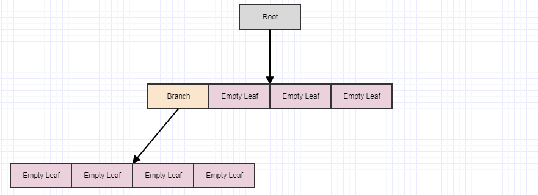

# Quadtrees

## 1. Efficient Quadtrees

### Efficient Quadtree for Collision Detection

All right, so actually quadtrees are not my favorite data structure for this purpose. I tend to prefer a grid hierarchy, like a coarse grid for the world, a finer grid for a region, and an even finer grid for a sub-region (3 fixed levels of dense grids, and no trees involved), with row-based optimizations so that a row that has no entities in it will be deallocated and turned into a null pointer, and likewise completely empty regions or sub-regions turned into nulls. While this simple implementation of the quadtree running in one thread can handle 100k agents on my i7 at 60+ FPS, I've implemented grids that can handle a couple million agents bouncing off each other every frame on older hardware (an i3). Also I always liked how grids made it very easy to predict how much memory they'll require, since they don't subdivide cells. But I'll try to cover how to implement a reasonably efficient quadtree.

Note that I won't go into the full theory of the data structure. I'm assuming that you already know that and are interested in improving performance. I'm also just going into my personal way of tackling this problem which seems to outperform most of the solutions I find online for my cases, but there are many decent ways and these solutions are tailor-fitted to my use cases (very large inputs with everything moving every frame for visual FX in films and television). Other people probably optimize for different use cases. When it comes to spatial indexing structures in particular, I really think the efficiency of the solution tells you more about the implementer than the data structure. Also the same strategies I'll propose to speeding things up also apply in 3 dimensions with octrees.

### Node Representation

So first of all, let's cover the node representation:

```cpp
// Represents a node in the quadtree.
struct QuadNode
{
    // Points to the first child if this node is a branch or the first
    // element if this node is a leaf.
    int32_t first_child;

    // Stores the number of elements in the leaf or -1 if it this node is
    // not a leaf.
    int32_t count;
};
```

It's a total of 8 bytes, and this is very important as it's a key part of the speed. I actually use a smaller one (6 bytes per node) but I'll leave that as an exercise to the reader.

You can probably do without the `count`. I include that for pathological cases to avoid linearly traversing the elements and counting them each time a leaf node might split. In most common cases a node shouldn't store that many elements. However, I work in visual FX and the pathological cases aren't necessarily rare. You can encounter artists creating content with a boatload of coincident points, massive polygons that span the entire scene, etc, so I end up storing a `count`.

### Where are the AABBs?

So one of the first things people might be wondering is where the bounding boxes (rectangles) are for the nodes. I don't store them. I compute them on the fly. I'm kinda surprised most people don't do that in the code I've seen. For me, they're only stored with the tree structure (basically just one AABB for the root).

That might seem like it'd be more expensive to be computing these on the fly, but reducing the memory use of a node can proportionally reduce cache misses when you traverse the tree, and those cache miss reductions tend to be more significant than having to do a couple of bitshifts and some additions/subtractions during traversal. Traversal looks like this:

```cpp
static QuadNodeList find_leaves(const Quadtree& tree, const QuadNodeData& root, const int rect[4])
{
    QuadNodeList leaves, to_process;
    to_process.push_back(root);
    while (to_process.size() > 0)
    {
        const QuadNodeData nd = to_process.pop_back();

        // If this node is a leaf, insert it to the list.
        if (tree.nodes[nd.index].count != -1)
            leaves.push_back(nd);
        else
        {
            // Otherwise push the children that intersect the rectangle.
            const int mx = nd.crect[0], my = nd.crect[1];
            const int hx = nd.crect[2] >> 1, hy = nd.crect[3] >> 1;
            const int fc = tree.nodes[nd.index].first_child;
            const int l = mx-hx, t = my-hx, r = mx+hx, b = my+hy;

            if (rect[1] <= my)
            {
                if (rect[0] <= mx)
                    to_process.push_back(child_data(l,t, hx, hy, fc+0, nd.depth+1));
                if (rect[2] > mx)
                    to_process.push_back(child_data(r,t, hx, hy, fc+1, nd.depth+1));
            }
            if (rect[3] > my)
            {
                if (rect[0] <= mx)
                    to_process.push_back(child_data(l,b, hx, hy, fc+2, nd.depth+1));
                if (rect[2] > mx)
                    to_process.push_back(child_data(r,b, hx, hy, fc+3, nd.depth+1));
            }
        }
    }
    return leaves;
}
```

Omitting the AABBs is one of the most unusual things I do (I keep looking for other people doing it just to find a peer and fail), but I've measured the before and after and it did reduce times considerably, at least on very large inputs, to compact the quadtree node substantially and just compute AABBs on the fly during traversal. Space and time aren't always diametrically opposed. Sometimes reducing space also means reducing time given how much performance is dominated by the memory hierarchy these days. I've even sped up some real world operations applied on massive inputs by compressing the data to quarter the memory use and decompressing on the fly.

I don't know why many people choose to cache the AABBs: whether it's programming convenience or if it's genuinely faster in their cases. Yet for data structures which split evenly down the center like regular quadtrees and octrees, I'd suggest measuring the impact of omitting the AABBs and computing them on the fly. You might be quite surprised. Of course it makes sense to store AABBs for structures that don't split evenly like Kd-trees and BVHs as well as loose quadtrees.

### Floating-Point

I don't use floating-point for spatial indexes and maybe that's why I see improved performance just computing AABBs on the fly with right shifts for division by 2 and so forth. That said, at least SPFP seems really fast nowadays. I don't know since I haven't measured the difference. I just use integers by preference even though I'm generally working with floating-point inputs (mesh vertices, particles, etc). I just end up converting them to integer coordinates for the purpose of partitioning and performing spatial queries. I'm not sure if there's any major speed benefit of doing this anymore. It's just a habit and preference since I find it easier to reason about integers without having to think about denormalized FP and all that.

### Centered AABBs

While I only store a bounding box for the root, it helps to use a representation that stores a center and half size for nodes while using a left/top/right/bottom representation for queries to minimize the amount of arithmetic involved.

### Contiguous Children

This is likewise key, and if we refer back to the node rep:

```cpp
struct QuadNode
{
    int32_t first_child;
    ...
};
```

We don't need to store an array of children because all 4 children are contiguous:

```
first_child+0 = index to 1st child (TL)
first_child+1 = index to 2nd child (TR)
first_child+2 = index to 3nd child (BL)
first_child+3 = index to 4th child (BR)
```

This not only significantly reduces cache misses on traversal but also allows us to significantly shrink our nodes which further reduces cache misses, storing only one 32-bit index (4 bytes) instead of an array of 4 (16 bytes).

This does mean that if you need to transfer elements to just a couple of quadrants of a parent when it splits, it must still allocate all 4 child leaves to store elements in just two quadrants while having two empty leaves as children. However, the trade-off is more than worth it performance-wise at least in my use cases, and remember that a node only takes 8 bytes given how much we've compacted it.

When deallocating children, we deallocate all four at a time. I do this in constant-time using an indexed free list, like so:


Except we're pooling out memory chunks containing 4 contiguous elements instead of one at a time. This makes it so we usually don't need to involve any heap allocations or deallocations during the simulation. A group of 4 nodes gets marked as freed indivisibly only to then be reclaimed indivisibly in a subsequent split of another leaf node.

### Deferred Cleanup

I don't update the quadtree's structure right away upon removing elements. When I remove an element, I just descend down the tree to the child node(s) it occupies and then remove the element, but I don't bother to do anything more just yet even if the leaves become empty.

Instead I do a deferred cleanup like this:

```cpp
void Quadtree::cleanup()
{
    // Only process the root if it's not a leaf.
    SmallList<int> to_process;
    if (nodes[0].count == -1)
        to_process.push_back(0);

    while (to_process.size() > 0)
    {
        const int node_index = to_process.pop_back();
        QuadNode& node = nodes[node_index];

        // Loop through the children.
        int num_empty_leaves = 0;
        for (int j=0; j < 4; ++j)
        {
            const int child_index = node.first_child + j;
            const QuadNode& child = nodes[child_index];

            // Increment empty leaf count if the child is an empty
            // leaf. Otherwise if the child is a branch, add it to
            // the stack to be processed in the next iteration.
            if (child.count == 0)
                ++num_empty_leaves;
            else if (child.count == -1)
                to_process.push_back(child_index);
        }

        // If all the children were empty leaves, remove them and
        // make this node the new empty leaf.
        if (num_empty_leaves == 4)
        {
            // Push all 4 children to the free list.
            nodes[node.first_child].first_child = free_node;
            free_node = node.first_child;

            // Make this node the new empty leaf.
            node.first_child = -1;
            node.count = 0;
        }
    }
}
```

This is called at the end of every single frame after moving all the agents. The reason I do this kind of deferred removal of empty leaf nodes in multiple iterations and not all at once in the process of removing a single element is that element `A` might move to node `N2`, making `N1` empty. However, element `B` might, in the same frame, move to `N1`, making it occupied again.

With the deferred cleanup, we can handle such cases without unnecessarily removing children only to add them right back when another element moves into that quadrant.

Moving elements in my case is a straightforward: 1) remove element, 2) move it, 3) reinsert it to the quadtree. After we move all the elements and at the end of a frame (not time step, there could be multiple time steps per frame), the `cleanup` function above is called to remove the children from a parent which has 4 empty leaves as children, which effectively turns that parent into the new empty leaf which might then be cleaned up in the next frame with a subsequent `cleanup` call (or not if things get inserted to it or if the empty leaf's siblings are non-empty).

Let's look at the deferred cleanup visually:


Starting with this, let's say we remove some elements from the tree leaving us with 4 empty leaves:


At this point, if we call cleanup, it will remove 4 leaves if it finds 4 empty child leaves and turn the parent into an empty leaf, like so:


Let's say we remove some more elements:



... and then call cleanup again:


If we call it yet again, we end up with this:


... at which point the root itself turns into an empty leaf. However, the cleanup method never removes the root (it only removes children). Again the main point of doing it deferred this way and in multiple steps is to reduce the amount of potential redundant work that could occur per time step (which can be a lot) if we did this all immediately every single time an element is removed from the tree. It also helps to distribute that works across frames to avoid stutters.

TBH, I originally applied this "deferred cleanup" technique in a DOS game I wrote in C out of sheer laziness! I didn't want to bother with descending down the tree, removing elements, and then removing nodes in a bottom-up fashion back then because I originally wrote the tree to favor top-down traversal (not top-down and back up again) and really thought this lazy solution was a productivity compromise (sacrificing optimal performance to get implemented faster). However, many years later, I actually got around to implementing quadtree removal in ways that immediately started removing nodes and, to my surprise, I actually significantly made it slower with more unpredictable and stuttery frame rates. The deferred cleanup, in spite of originally being inspired by my programmer laziness, was actually (and accidentally) a very effective optimization for dynamic scenes.

### Singly-Linked Index Lists for Elements

For elements, I use this representation:

```cpp
// Represents an element in the quadtree.
struct QuadElt
{
    // Stores the ID for the element (can be used to
    // refer to external data).
    int id;

    // Stores the rectangle for the element.
    int x1, y1, x2, y2;
};

// Represents an element node in the quadtree.
struct QuadEltNode
{
    // Points to the next element in the leaf node. A value of -1
    // indicates the end of the list.
    int next;

    // Stores the element index.
    int element;
};
```

I use an "element node" which is separate from "element". An element is only inserted once to the quadtree no matter how many cells it occupies. However, for each cell it occupies, an "element node" is inserted which indexes that element.

The element node is a singly-linked index list node into an array, and also using the free list method above. This incurs some more cache misses over storing all the elements contiguously for a leaf. However, given that this quadtree is for very dynamic data which is moving and colliding every single time step, it generally takes more processing time than it saves to seek out a perfectly contiguous representation for the leaf elements (you would effectively have to implement a variable-sized memory allocator which is really fast, and that's far from an easy thing to do). So I use the singly-linked index list which allows a free list constant-time approach to allocation/deallocation. When you use that representation, you can transfer elements from split parents to new leaves by just changing a few integers.

`SmallList<T>`

Oh, I should mention this. Naturally it helps if you don't heap allocate just to store a temporary stack of nodes for non-recursive traversal. `SmallList<T>` is similar to `vector<T>` except it won't involve a heap allocation until you insert more than 128 elements to it. It's similar to SBO string optimizations in the C++ standard lib. It's something I implemented and have been using for ages and it does help a lot to make sure you use the stack whenever possible.

### Tree Representation

Here's the representation of the quadtree itself:

```cpp
struct Quadtree
{
    // Stores all the elements in the quadtree.
    FreeList<QuadElt> elts;

    // Stores all the element nodes in the quadtree.
    FreeList<QuadEltNode> elt_nodes;

    // Stores all the nodes in the quadtree. The first node in this
    // sequence is always the root.
    std::vector<QuadNode> nodes;

    // Stores the quadtree extents.
    QuadCRect root_rect;

    // Stores the first free node in the quadtree to be reclaimed as 4
    // contiguous nodes at once. A value of -1 indicates that the free
    // list is empty, at which point we simply insert 4 nodes to the
    // back of the nodes array.
    int free_node;

    // Stores the maximum depth allowed for the quadtree.
    int max_depth;
};

```

As pointed out above, we store a single rectangle for the root (`root_rect`). All sub-rects are computed on the fly. All nodes are stored in contiguously in an array (`std::vector<QuadNode>`) along with the elements and element nodes (in `FreeList<T>`).

`FreeList<T>`

I use a `FreeList` data structure which is basically an array (and random-access sequence) that lets you remove elements from anywhere in constant-time (leaving holes behind which get reclaimed upon subsequent insertions in constant-time). Here's a simplified version which doesn't bother with handling non-trivial data types (doesn't use placement new or manual destruction calls):

```cpp
/// Provides an indexed free list with constant-time removals from anywhere
/// in the list without invalidating indices. T must be trivially constructible
/// and destructible.
template <class T>
class FreeList
{
public:
    /// Creates a new free list.
    FreeList();

    /// Inserts an element to the free list and returns an index to it.
    int insert(const T& element);

    // Removes the nth element from the free list.
    void erase(int n);

    // Removes all elements from the free list.
    void clear();

    // Returns the range of valid indices.
    int range() const;

    // Returns the nth element.
    T& operator[](int n);

    // Returns the nth element.
    const T& operator[](int n) const;

private:
    union FreeElement
    {
        T element;
        int next;
    };
    std::vector<FreeElement> data;
    int first_free;
};

template <class T>
FreeList<T>::FreeList(): first_free(-1)
{
}

template <class T>
int FreeList<T>::insert(const T& element)
{
    if (first_free != -1)
    {
        const int index = first_free;
        first_free = data[first_free].next;
        data[index].element = element;
        return index;
    }
    else
    {
        FreeElement fe;
        fe.element = element;
        data.push_back(fe);
        return static_cast<int>(data.size() - 1);
    }
}

template <class T>
void FreeList<T>::erase(int n)
{
    data[n].next = first_free;
    first_free = n;
}

template <class T>
void FreeList<T>::clear()
{
    data.clear();
    first_free = -1;
}

template <class T>
int FreeList<T>::range() const
{
    return static_cast<int>(data.size());
}

template <class T>
T& FreeList<T>::operator[](int n)
{
    return data[n].element;
}

template <class T>
const T& FreeList<T>::operator[](int n) const
{
    return data[n].element;
}
```

I have one which does work with non-trivial types and provides iterators and so forth but is much more involved. These days I tend to work more with trivially constructible/destructible C-style structs anyway (only using non-trivial user-defined types for high-level stuff).

### Maximum Tree Depth

I prevent the tree from subdividing too much by specifying a max depth allowed. For the quick simulation I whipped up, I used 8. For me this is crucial since again, in VFX I encounter pathological cases a lot including content created by artists with lots of coincident or overlapping elements which, without a maximum tree depth limit, could want it to subdivide indefinitely.

There is a bit of fine-tuning if you want optimal performance with respect to max depth allowed and how many elements you allow to be stored in a leaf before it splits into 4 children. I tend to find the optimal results are gained with something around 8 elements max per node before it splits, and a max depth set so that the smallest cell size is a little over the size of your average agent (otherwise more single agents could be inserted into multiple leaves).

### Collision and Queries

There are a couple of ways to do the collision detection and queries. I often see people do it like this:

```
for each element in scene:
     use quad tree to check for collision against other elements
```

This is very straightforward but the problem with this approach is that the first element in the scene might be in a totally different location in the world from the second. As a result, the paths we take down the quadtree could be totally sporadic. We might traverse one path to a leaf and then want to go down that same path again for the first element as, say, the 50,000th element. By this time the nodes involved in that path may have already been evicted from the CPU cache. So I recommend doing it this way:

```
traversed = {}
gather quadtree leaves
for each leaf in leaves:
{
     for each element in leaf:
     {
          if not traversed[element]:
          {
              use quad tree to check for collision against other elements
              traversed[element] = true
          }
     }
}
```

While that's quite a bit more code and requires we keep a traversed bitset or parallel array of some sort to avoid processing elements twice (since they may be inserted in more than one leaf), it helps make sure that we descend the same paths down the quadtree throughout the loop. That helps keep things much more cache-friendly. Also if after attempting to move the element in the time step, it's still encompassed entirely in that leaf node, we don't even need to work our way back up again from the root (we can just check that one leaf only).

### Common Inefficiencies: Things to Avoid

While there are many ways to skin the cat and achieve an efficient solution, there is a common way to achieve a very inefficient solution. And I've encountered my share of very inefficient quadtrees, kd trees, and octrees in my career working in VFX. We're talking over a gigabyte of memory use just to partition a mesh with 100k triangles while taking 30 secs to build, when a decent implementation should be able to do the same hundreds of times a second and just take a few megs. There are many people whipping these up to solve problems who are theoretical wizards but didn't pay much attention to memory efficiency.

So the absolute most common no-no I see is to store one or more full-blown containers with each tree node. By full-blown container, I mean something that owns and allocates and frees its own memory, like this:

```cpp
struct Node
{
     ...

     // Stores the elements in the node.
     List<Element> elements;
};
```

And `List<Element>` might be a list in Python, an `ArrayList` in Java or C#, `std::vector` in C++, etc: some data structure that manages its own memory/resources.

The problem here is that while such containers are very efficiently implemented for storing a large number of elements, all of them in all languages are extremely inefficient if you instantiate a boatload of them only to store a few elements in each one. One of the reasons is that the container metadata tends to be quite explosive in memory usage at such a granular level of a single tree node. A container might need to store a size, capacity, a pointer/reference to data it allocates, etc, and all for a generalized purpose so it might use 64-bit integers for size and capacity. As a result the metadata just for an empty container might be 24 bytes which is already 3 times larger than the entirety of the node representation I proposed, and that's just for an empty container designed to store elements in leaves.

Furthermore each container often wants to either heap/GC-allocate on insertion or require even more preallocated memory in advance (at which point it might take 64 bytes just for the container itself). So that either becomes slow because of all the allocations (note that GC allocations are really fast initially in some implementations like JVM, but that's only for the initial burst Eden cycle) or because we're incurring a boatload of cache misses because the nodes are so huge that barely any fit into the lower levels of the CPU cache on traversal, or both.

Yet this is a very natural inclination and makes intuitive sense since we talk about these structures theoretically using language like, "Elements are stored in the leaves" which suggests storing a container of elements in leaf nodes. Unfortunately it has an explosive cost in terms of memory use and processing. So avoid this if the desire is to create something reasonably efficient. Make the `Node` share and point to (refer to) or index memory allocated and stored for the entire tree, not for every single individual node. In actuality the elements shouldn't be stored in the leaves.

> Elements should be stored in the _tree_ and leaf nodes should _index_ or _point_ to those elements.

### Conclusion

Phew, so those are the main things I do to achieve what is hopefully considered a decent-performing solution. I hope that helps. Note that I am aiming this at a somewhat advanced level for people who have already implemented quadtrees at least once or twice. If you have any questions, feel free to shoot.

Since this question is a bit broad, I might come and edit it and keep tweaking and expanding it over time if it doesn't get closed (I love these types of questions since they give us an excuse to write about our experiences working in the field, but the site doesn't always like them). I'm also hoping some experts might jump in with alternative solutions I can learn from and perhaps use to improve mine further.

Again quadtrees aren't actually my favorite data structure for extremely dynamic collision scenarios like this. So I probably have a thing or two to learn from people who do favor quadtrees for this purpose and have been tweaking and tuning them for years. Mostly I use quadtrees for static data that doesn't move around every frame, and for those I use a very different representation from the one proposed above.

## 2. Fundamentals

I'll focus more on fundamentals aimed at someone new to these structures.

All right, so let's say we have a bunch of elements like this in space:


And we want to find out what element is under the mouse cursor, or what elements intersect/collide with each other, or what the nearest element is to another element, or something of this sort.

In that case, if the only data we had was a bunch of element positions and sizes/radii in space, we'd have to loop through everything to find out what element is within a given search area. For collision detection, we'd have to loop through every single element and then, for each element, loop through all other elements, making it an explosive quadratic complexity algorithm. That isn't going to hold up on non-trivial input sizes.

### Subdivide

So what can we do about this problem? One of the straightforward approaches is to subdivide the search space (screen, e.g.) into a fixed number of cells, like so:


Now let's say you want to find the element under your mouse cursor at position `(cx, cy)`. In that case, all we have to do is check the elements in the cell under mouse cursor:

```cpp
grid_x = floor(cx / cell_size);
grid_y = floor(cy / cell_size);
for each element in cell(grid_x, grid_y):
{
     if element is under cx,cy:
         do something with element (hover highlight it, e.g)
}
```

Similar thing for collision detection. If we want to see what elements intersect (collide) with a given element:

```cpp
grid_x1 = floor(element.x1 / cell_size);
grid_y1 = floor(element.y1 / cell_size);
grid_x2 = floor(element.x2 / cell_size);
grid_y2 = floor(element.y2 / cell_size);

for grid_y = grid_y1, grid_y2:
{
     for grid_x = grid_x1, grid_x2:
     {
         for each other_element in cell(grid_x, grid_y):
         {
             if element != other_element and collide(element, other_element):
             {
                 // The two elements intersect. Do something in response
                 // to the collision.
             }
         }
     }
}
```

And I recommend people start this way by dividing up the space/screen into a fixed number of grid cells like 10x10, or 100x100, or even 1000x1000. Some people might think 1000x1000 would be explosive in memory use but you can make each cell require only 4 bytes with 32-bit integers, like so:


... at which point even a million cells takes less than 4 megabytes.

### Downside of a Fixed-Resolution Grid

The fixed resolution grid is a fantastic data structure for this problem if you ask me (my personal favorite for collision detection), but it does have some weaknesses.

Imagine you have a Lord of the Rings video game. Let's say many of your units are small units on the map like humans, orcs, and elves. However, you also have some gigantic units like dragons and ents.

Here a problem with the fixed resolution of the grid is that while your cell sizes might be optimal for storing those small units like humans and elves and orcs which occupy just 1 cell most of the time, the huge dudes like dragons and ents might want to occupy many cells, say, 400 cells (20x20). As a result we have to insert those big guys into many cells and store a lot of redundant data.

Also let's say you want to search a large rectangular region of the map for units of interest. In that case, you might have to check way more cells than theoretically optimal.

This is the main disadvantage of a fixed resolution grid\*. We end up potentially having to insert large things and store them into far more cells than we should ideally have to store, and for large search areas, we may have to check far more cells than we should ideally have to search.

> That said, putting aside the theory, often you can work with grids in a way that is very cache-friendly in ways similar to image processing. As a result, while it has these theoretical disadvantages, in practice the simplicity and ease of implementing cache-friendly traversal patterns can make the grid a lot better than it sounds.

### Quadtrees

So quadtrees are one solution to this problem. Instead of using a fixed resolution grid, so to speak, they adapt the resolution based on some criteria, while subdividing/splitting into 4 child cells to increase resolution. For example, we might say a cell should split if there are more than 2 children in a given cell. In that case, this:


Ends up becoming this:


And now we have a pretty nice representation where no cell stores more than 2 elements. Meanwhile let's consider what happens if we insert a huge dragon:


Here, unlike the fixed resolution grid, the dragon can just be inserted into one cell since the cell it occupies only has one element in it. Likewise if we search a big area of the map, we won't have to check so many cells unless there are many elements occupying the cells.

### Implementation

So how do we implement one of these thingies? Well, it's a tree at the end of the day, and a 4-ary tree at that. So we start off with the notion of a root node with 4 children, but they're currently null/nil and the root is also a leaf at the moment:


### Insertion

Let's start inserting some elements, and again for simplicity, let's say a node should split when it has more than 2 elements. So we'll insert an element, and when we insert an element we should insert it to the leaves (cells) in which it belongs. In this case we only have one, the root node/cell, and so we'll insert it there:


... and let's insert another:


... and yet another:


And now we have more than 2 elements in a leaf node. It should now split. At this point we create 4 children to the leaf node (our root in this case) and then transfer the elements from the leaf being split (the root) into the appropriate quadrants based on the area/cell each element occupies in space:


Let's insert another element, and again to the appropriate leaf in which it belongs:


... and another:


And now we have more than 2 elements in a leaf again, so we should split it into 4 quadrants (children):


And that's the basic idea. One of the things you might notice is that when we're inserting elements that aren't infinitesimally small points, they can easily overlap multiple cells/nodes.

As a result if we have many elements that overlap many boundaries between cells, they could end up wanting to subdivide a whole lot, possibly infinitely. To mitigate this issue, some people choose to split the element. If all you associate with an element is a rectangle, it's fairly straightforward to dice up rectangles. Other people might just put a depth/recursion limit on how much the tree can split. I tend to prefer the latter solution for collision detection scenarios between these two since I find it at least easier to implement more efficiently. However, there's another alternative: loose representations, and that'll be covered in a different section.

Also if you have elements right on top of each other, then your tree could want to split indefinitely even if you're storing infinitesimally small points. For example, if you have 25 points right on top of each other in space (a scenario I encounter rather often in VFX), then your tree will want to split indefinitely without a recursion/depth limit no matter what. As a result, to handle pathological cases, you might need a depth limit even if you do dice up elements.

### Removing Elements

Removing elements is covered in the first answer along with removing nodes to clean up the tree and remove empty leaves. But basically all we do to remove an element using my proposed approach is just descend down the tree to where the leaf/leaves in which the element is stored (which you can determine using its rectangle, e.g.), and remove it from those leaves.

Then to start removing empty leaf nodes, we use a deferred cleanup approach covered in the original answer.

### Conclusion

I'm running short on time but will try to come back to this one and keep improving the answer. If people want an exercise, I would suggest implementing a plain old fixed-resolution grid, and see if you can get it down to where each cell is just a 32-bit integer. First understand the grid and its inherent problems before considering the quadtree, and you may be just fine with the grid. It might even provide you the most optimal solution depending on how efficiently you can implement a grid vs. a quadtree.

### Edit: Fine/Coarse Grids and Row Optimizations

I got lots of questions on this so I'll go briefly into it. It's actually incredibly dumb-simple and might disappoint people who thought it was some fancy thing. So let's start with a simple fixed-resolution grid representation. I'll use pointers here to make it as simple as possible (although I recommend using an array and indices later on to have more control over memory use and access patterns).

```cpp
// Stores a node in a grid cell.
struct Node
{
    // Stores a pointer to the next node or null if we're at the end of
    // the list.
    Node* next = nullptr;

    // Stores a pointer to the element in the cell.
    Element* element = nullptr;
};

// Stores a 1000x1000 grid. Hard-coded for simple illustration.
Node* grid[1000][1000] = {};
```

As covered in the other answers, fixed-resolution grids are actually much more decent than they look even if they seem so dumb compared to tree-based solutions with variable resolution. However, they do come with a drawback that if we want to search a large parameter (like a huge circular or rectangular area), they have to loop through many grid cells. So we can mitigate that cost by storing a coarser grid:

```cpp
// Stores a lower-resolution 500x500 parent grid (can use bitsets instead
// of bools). Stores true if one or more elements occupies the cell or
// false if the cell is empty.
bool parent_grid[500][500] = {};

// Stores an even lower-resolution 100x100 grid. It functions similarly
// as the parent grid, storing true if ane element occupies the cell or
// false otherwise.
bool grandparent_grid[100][100] = {};
```

We can keep going and you can adjust the resolutions and the number of grids you use as you see fit. By doing this, when we want to search a large parameter, we start off checking the grandparent grid before we search the parent grid, and the parent before we check the full-resolution grid. We only proceed if the cells are not completely empty. This can help us exclude a whole bunch of cells to check from the highest-resolution grid in lots of cases involving large search parameters.

That's really all there is to it. It does require storing all the highest-resolution cells in memory unlike a quadtree, but I've always found it much easier to optimize since we don't have to chase pointers/indices around to traverse the children of each tree node. Instead, we just do array lookups with access patterns that are very cache-friendly.

### Row-Based Optimizations

So row-based optimization is also dumb simple (although it only applies when we use arrays and indices instead of pointers to nodes\*).

> Or custom memory allocators, but I really don't recommend using them for most purposes as it's quite unwieldy to have to deal with allocator and data structure separately. It is so much simpler for linked structures to emulate the effect of bulk allocation/deallocation and contiguous access patterns by just storing/reallocating arrays (ex: `std::vector`) and indices into them. For linked structures in particular and given that we now have 64-bit addressing, it's especially helpful to cut down the size of links to 32-bits or less by turning them into indices into a particular array unless you actually need to store more than 2^32-1 elements in your data structure.

If we imagine a grid like this:


... because we are storing all the nodes in one list structure for the entire grid, the memory stride to get from one element in a cell to the next could be quite large, causing us to skip around a lot in memory and incurring more cache misses as a result (and also loading more irrelevant data into cache lines).

We could eliminate that completely by storing a whole separate node list for every single cell (in which case all the elements in a cell could be stored perfectly contiguously), but that could be quite explosive in memory use and very inefficient in other ways. So the balance is to just store a separate node list per row. We improve spatial locality that way without having an explosive number of separate lists since there aren't that many rows compared to the total number of cells (`rows * columns`). Another thing you can do when you do that is that when a row is completely empty, you can deallocate even the memory for the grid cells for that entire row and just turn the entire row into a null pointer.

Finally, this enables more opportunities to parallelize insertion/removal/access, since you can guarantee that it's safe provided no two threads are modifying/accessing the same row at one time (something that is often quite easy to ensure).

## 3. Other Implementations

[Full C implementation here.](grid-loose.c)

[Full Java implementation here.](grid-loose.java)

So I spent some time thinking about an efficient implementation that's almost universally applicable (an exception would be functional languages). So I ended up porting my quadtree to C in a way such that all it needs are arrays of `int` to store everything.

The result isn't pretty but should work very efficiently on any language that allows you to store contiguous arrays of `int`. For Python there are libs like ndarray in numpy. For JS there are typed arrays. For Java and C#, we can use `int` arrays (not `Integer`, those are not guaranteed to be stored contiguously and they use a lot more mem than plain old `int`).

### C IntList

So I use one auxiliary structure built on `int` arrays for the entire quadtree to make it as easy as possible to port to other languages. It combines a stack/free list. This is all we need to implement everything talked about in the other answer in an efficient way.

### Using IntList

Using this data structure to implement everything doesn't yield the prettiest code. Instead of accessing elements and fields like this:

```c
elements[n].field = elements[n].field + 1;
```

... we end up doing it like this:

```c
il_set(&elements, n, idx_field, il_get(&elements, n, idx_field) + 1);
```

... which is disgusting, I know, but the point of this code is to be as efficient and portable as possible, not to be as easy to maintain as possible. The hope is that people can just use this quadtree for their projects without changing it or maintaining it.

Oh and feel free to use this code I post however you want, even for commercial projects. I would really love it if people let me know if they find it useful, but do as you wish.

## 4. Loose Quadtree

[Full implementation here.](grid-loose.cpp)

All right, I wanted to take some time to implement and explain loose quadtrees, since I find them very interesting and possibly even the most well-balanced for the widest variety of use cases involving very dynamic scenes.

### Loose Quadtree

All right, so what are loose quadtrees? They're basically quadtrees whose nodes are not perfectly split down the center into four even quadrants. Instead their AABBs (bounding rectangles) could overlap and be larger or often even be smaller than what you'd get if you split a node perfectly down the center into 4 quadrants.

So in this case we absolutely have to store the bounding boxes with each node, and so I represented it like this:

```c
struct LooseQuadNode
{
    // Stores the AABB of the node.
    float rect[4];

    // Stores the negative index to the first child for branches or the
    // positive index to the element list for leaves.
    int children;
};
```

This time I tried to use single-precision floating point to see how it well performs, and it did a very decent job.

### What's the Point?

All right, so what's the point? The main thing you can exploit with a loose quadtree is that you can treat each element you insert to the quadtree like a single point for the sake of insertion and removal. Therefore an element is never inserted into more than one leaf node in the entire tree since it's treated like an infinitesimally small point.

However, as we insert these "element points" into the tree, we expand the bounding boxes of each node we insert to in order to encompass the element's boundaries (the element's rectangle, e.g.). That allows us to find these elements reliably when we do a search query (ex: searching for all elements that intersect a rectangle or circle area).

Pros:

- Even the most gigantic agent only has to be inserted into one leaf node and will take no more memory than the smallest. As a result it is well-suited for scenes with elements whose sizes vary wildly from one to the next, and that's what I was stress testing in the 250k agent demo above.
- Uses less memory per element, especially huge elements.

Cons:

- While this speeds up insertion and removal, it inevitably slows down searches into the tree. What was previously a few basic comparisons with a center point of a node to determine which quadrants to descend into turns into a loop having to check each rectangle of each child to determine which ones intersect a search area.
- Uses more memory per node (5x more in my case).

### Expensive Queries

This first con would be pretty horrible for static elements since all we do is build the tree and search it in those cases. And I found with this loose quadtree that, in spite of spending a few hours tweaking and tuning it, there is a huge hotspot involved in querying it:


That said, this is actually my "personal best" implementation of a quadtree so far for dynamic scenes (though keep in mind that I favor hierarchical grids for this purpose and don't have that much experience using quadtrees for dynamic scenes) in spite of this glaring con. And it's because for dynamic scenes at least, we have to constantly move elements every single time step, and so there's a whole lot more to do with the tree than just querying it. It has to be updated all the time, and this actually does a pretty decent job at that.

What I like about the loose quadtree is that you can feel safe even if you have a boatload of massive elements in addition to a boatload of the teeniest elements. The massive elements won't take any more memory than the small ones. As a result if I was writing a video game with a massive world and wanted to just throw everything into one central spatial index to accelerate everything without bothering with a hierarchy of data structures as I usually do, then loose quadtrees and loose octrees might be perfectly balanced as the "one central universal data structure if we're going to be using just one for an entire dynamic world".

### Memory Use

In terms of memory use, while elements take less memory (especially massive ones), nodes take quite a bit more compared to my implementations where nodes don't even need to store an AABB. I found overall in a variety of test cases, including ones with many gigantic elements, that the loose quadtree tends to take slightly more memory with its beefy nodes (~33% more as a rough estimate). That said, it is performing better than the quadtree implementation in my original answer.

On the plus side, the memory use is more stable (which tends to translate to more stable and smooth frame rates). My original answer's quadtree took around 5+ secs before the memory usage became perfectly stable. This one tends to become stable just a second or two after starting it up, and most likely because elements never have to be inserted more than once (even small elements could be inserted twice in my original quadtree if they're overlapping two or more nodes at the boundaries). As a result the data structure quickly discovers the required amount of memory to allocate against all cases, to so to speak.

### Theory

So let's cover the basic theory. I recommend starting by implementing a regular quadtree first and understanding it before moving to loose versions as they are a bit harder to implement. When we start out with an empty tree, you can imagine it as also having an empty rectangle.

Let's insert one element:


Since we only have a root node at the moment which is also a leaf, we just insert it to that. Upon doing this, the previously empty rectangle of the root node now encompasses the element we inserted (shown in red dotted lines). Let's insert another:


We expand the AABBs of the nodes we traverse as we're inserting (this time just the root) by the AABBs of the elements we're inserting. Let's insert another, and let's say nodes should split when they contain more than 2 elements:


In this case we have more than 2 elements in a leaf node (our root), so we should split it into 4 quadrants. This is pretty much the same as splitting a regular point-based quadtree except we, again, expand bounding boxes as we transfer children. We begin by considering the center position of the node being split:


Now we have 4 children to our root node and each one also stores its also tight-fitting bounding box (shown in green). Let's insert another element:


Here you can see that inserting this element not only expanded the rectangle of the lower-left child, but also the root (we expand all AABBs along the path we're inserting). Let's insert another:


In this case we have 3 elements again in a leaf node, so we should split:


Just like so. Now what about that circle on the lower left? It appears to be intersecting 2 quadrants. However, we only consider one point of the element (ex: its center) to determine the quadrant to which it belongs. So that circle actually only gets inserted to the lower-left quadrant.

However, the lower-left quadrant's bounding box is expanded to encompass its extents (shown in cyan, and hope you guys don't mind but I changed the BG color since it was getting hard to see the colors), and so the AABBs of the nodes at level 2 (shown in cyan) actually spill into each other's quadrants.

The fact that each quadrant stores its own rectangle which is always guaranteed to encompass its elements is what allows us to insert an element to just one leaf node even if its area intersects multiple nodes. Instead we expand the leaf node's bounding box instead of inserting the element to multiple nodes.

### Updating AABBs

So this might lead to the question, when are AABBs updated? If we only expand AABBs upon inserting elements, they'll just tend to grow bigger and bigger. How do we shrink them when the elements are removed? There are many ways to tackle this, but I do it by updating the bounding boxes of the entire hierarchy in that "cleanup" method described in my original answer. That seems to be fast enough (doesn't even show up as a hotspot).

### Comparing to Grids

I still can't seem to implement this nearly as efficiently for collision detection as my hierarchical grid implementations, but again that might just be more about me than the data structure. The main difficulty I find with tree structures is easily controlling where everything is in memory and how it is accessed. With the grid you can make sure that all columns of a row are contiguous and laid out sequentially, for example, and make sure you access them in a sequential fashion along with the elements contiguously stored in that row. With a tree, the memory access tends to be a bit sporadic just by nature and also tends to degrade rapidly as trees want to transfer elements a lot more often as nodes get split into multiple children. That said, if I wanted to use a spatial index which was a tree, I'm really digging these loose variants so far, and ideas are popping in my head for implementing a "loose grid".

### Conclusion

So that's loose quadtrees in a nutshell, and it basically has the insertion/removal logic of a regular quadtree that just stores points except that it expands/updates AABBs on the way. For searching, we end up traversing all child nodes whose rectangles intersect our search area.

> I hope people don't mind me posting so many lengthy answers. I'm really getting a kick out of writing them and it has been a useful exercise for me in revisiting quadtrees to attempt to write all these answers. I'm also contemplating a book on these topics at some point (though it'll be in Japanese) and writing some answers here, while hasty and in English, helps me kind of put everything together in my brain. Now I just need someone to ask for an explanation of how to write efficient octrees or grids for the purpose of collision detection to give me an excuse to do the same on those subjects.

## 5. Loose/Tight Double-Grid With 500k Agents

It is the best-performing data structure so far among all the ones I've shown that I've implemented (though it could just be me), handling half a million agents better than the initial quadtree handled 100k, and better than the loose quadtree handled 250k. It also requires the least amount of memory and has the most stable memory use among these three. This is all still working in just one thread, no SIMD code, no fancy micro-optimizations as I typically apply for production code -- just a straightforward implementation from a couple hours of work.

I also improved the drawing bottlenecks without improving my rasterization code whatsoever. It's because the grid lets me easily traverse it in a way that's cache-friendly for image processing (drawing the elements in the cells of the grid one-by-one coincidentally happens to lead to very cache-friendly image processing patterns when rasterizing).

Funnily enough it also took the shortest time for me to implement (only 2 hours while I spent 5 or 6 hours on the loose quadtree), and it also requires the least amount of code (and arguably has the simplest code). Though that might just be because I've accumulated so much experience implementing grids.

### Loose/Tight Double Grid

So I covered how grids worked in the fundamentals section (see part 2), but this is a "loose grid". Each grid cell stores its own bounding box that is allowed to shrink as elements are removed and grow as elements are added. As a result each element only needs to be inserted once into the grid based on which cell its center position lands inside, like so:

```cpp
// Ideally use multiplication here with inv_cell_w or inv_cell_h.
int cell_x = clamp(floor(elt_x / cell_w), 0, num_cols-1);
int cell_y = clamp(floor(ely_y / cell_h), 0, num_rows-1);
int cell_idx = cell_y*num_rows + cell_x;
// Insert element to cell at 'cell_idx' and expand the loose cell's AABB.
Cells store elements and AABBs like this:

struct LGridLooseCell
{
    // Stores the index to the first element using an indexed SLL.
    int head;

    // Stores the extents of the grid cell relative to the upper-left corner
    // of the grid which expands and shrinks with the elements inserted and
    // removed.
    float l, t, r, b;
};
```

However, loose cells pose a conceptual problem. Given that they have these variable-sized bounding boxes which can grow huge if we insert a huge element, how do we avoid checking every single freaking cell of the grid when we want to find out which loose cells and corresponding elements intersect a search rectangle? There could be a case where we're searching the upper-right corner of the loose grid but there's a cell in the lower-left on the opposite side which has grown large enough to intersect that area as well. Without a solution to this problem, we're reduced to having to check all the loose cells in linear time for matches.

... and the solution is that actually this is a "double grid". The loose grid cells themselves are partitioned into a tight grid. When we do the analogical search above, we first look through the tight grid like so:

```cpp
tx1 = clamp(floor(search_x1 / cell_w), 0, num_cols-1);
tx2 = clamp(floor(search_x2 / cell_w), 0, num_cols-1);
ty1 = clamp(floor(search_y1 / cell_h), 0, num_rows-1);
ty2 = clamp(floor(search_y2 / cell_h), 0, num_rows-1);

for ty = ty1, ty2:
{
    trow = ty * num_cols
    for tx = tx1, tx2:
    {
        tight_cell = tight_cells[trow + tx];
        for each loose_cell in tight_cell:
        {
            if loose_cell intersects search area:
            {
                for each element in loose_cell:
                {
                    if element intersects search area:
                        add element to query results
                }
            }
        }
    }
}
```

Tight cells store a singly-linked index list of loose cells, like so:

```cpp
struct LGridLooseCellNode
{
    // Points to the next loose cell node in the tight cell.
    int next;

    // Stores an index to the loose cell.
    int cell_idx;
};

struct LGridTightCell
{
    // Stores the index to the first loose cell node in the tight cell using
    // an indexed SLL.
    int head;
};
```

And voila, that's the basic idea of the "loose double-grid". When we insert an element, we expand the loose cell's AABB just as we do for a loose quadtree, only in constant-time instead of logarithmic time. However, we also insert the loose cell to the tight grid in constant time based on its rectangle (and it could be inserted into multiple cells).

The combo of these two (tight grid to rapidly find loose cells, and loose cells to rapidly find elements) gives a very lovely data structure where each element is inserted into a single cell with constant time searches, insertion, and removals.

The only big downside I see is that we do have to store all these cells and potentially still have to search more cells than we need, but they're still reasonably cheap (20 bytes per cell in my case) and it's easy to traverse the cells on searches in a very cache-friendly access pattern.

I recommend giving this idea of "loose grids" a try. It is arguably a lot easier to implement than quadtrees and loose quadtrees and, more importantly, optimize, since it immediately lends itself to a cache-friendly memory layout. As a super cool bonus, if you can anticipate the number of agents in your world in advance, it is almost 100% perfectly stable and immediately in terms of memory use, since an element always occupies exactly one cell, and the number of cells total is fixed (since they don't subdivide/split). The only minor instability in memory use is that those loose cells might expand and get inserted into additional tight cells in the coarser grid every now and then, yet this should be quite infrequent. As a result, the memory use is very stable/consistent/predictable and also often the corresponding frame rates. That could be a huge bonus for certain hardware and software where you want to pre-allocate all memory in advance.

It's also really easy to make it work with SIMD to do multiple coherent queries simultaneously with vectorized code (in addition to multithreading), since the traversal, if we can even call it that, is flat (it's just a constant-time lookup into a cell index which involves some arithmetic). As a result it's fairly easy to apply optimization strategies similar to ray packets that Intel applies to their raytracing kernel/BVH (Embree) to test for multiple coherent rays simultaneously (in our case they would be "agent packets" for collision), except without such fancy/complex code since grid "traversal" is so much simpler.

### On Memory Use and Efficiency

I covered this a bit in part 1 on efficient quadtrees, but reducing memory use is often the key to speed these days since our processors are so fast once you get the data into, say, L1 or a register, but DRAM access is relatively so, so slow. We have so precious little fast memory still even if we have an insane amount of slow memory.

I think I'm kind of lucky starting off at a time when we had to be very frugal with memory use (though not as much as the people before me), where even a megabyte of DRAM was considered amazing. Some of the things I learned back then and habits I picked up (even though I'm far from an expert) coincidentally aligns with performance. Some of it I've had to discard as bad habits which are counter-productive these days and I've learned to embrace waste in areas where it doesn't matter. A combination of the profiler and tight deadlines helps keep me productive and not end up with priorities that are too out of whack.

So one general piece of advice I'd offer on efficiency in general, not just spatial indexes used for collision detection, is watch that memory use. If it's explosive, chances are that the solution won't be very efficient. Of course there's a grey zone where using a bit more memory for a data structure can substantially reduce processing to the point where it's beneficial only considering speed, but a lot of times reducing the amount of memory required for data structures, especially the "hot memory" that is accessed repeatedly, can translate quite proportionally to a speed improvement. All the least efficient spatial indexes I encountered in my career were the most explosive in memory use.

It's helpful to look at the amount of data you need to store and calculate, at least roughly, how much memory it should ideally require. Then compare it to how much you actually require. If the two are worlds apart, then you'll likely get a decent boost trimming down the memory use because that'll often translate to less time loading chunks of memory from the slower forms of memory in the memory hierarchy.

## 6. Dirty Trick: Uniform Sizes

For this answer I'll cover an underhanded trick which can allow your simulation to run an order of magnitude faster if the data is appropriate (which it often will be in many video games, e.g.). It can get you from tens of thousands to hundreds of thousands of agents, or hundreds of thousands of agents to millions of agents. I haven't applied it in any of the demonstrations shown in my answers so far since it's a bit of a cheat, but I have used it in production and it can make a world of difference. And funnily I don't see it discussed that often. Actually I've never seen it discussed which is weird.

So let's come back to the Lord of the Rings example. We have a lot of "humanish-sized" units like humans, elves, dwarves, orcs, and hobbits, and we also have some ginormous units like dragons and ents.

The "humanish-sized" units don't vary that much in size. A hobbit might be four feet tall and a bit stocky, an orc might be 6'4. There's some difference but it's not an epic difference. It's not an order of magnitude difference.

So what happens if we put a bounding sphere/box around a hobbit which is the size of an orc's bounding sphere/box just for the sake of coarse intersection queries (before we drill down to checking for more true collision on a granular/fine level)? There's a little bit of wasted negative space but something really interesting happens.

If we can foresee such an upper bound on common-case units, we can store them in a data structure which assumes that all things have a uniform upper bound size. A couple of really interesting things happen in this case:

1. We don't have to store a size with each element. The data structure can assume that all elements inserted to it have the same uniform size (just for the purpose of coarse intersection queries). This can almost halve memory use for elements in many scenarios and it naturally speeds up traversal when we have less memory/data to access per element.
2. We can store elements in just one cell/node, even for tight representations that don't have variable-sized AABBs stored in cells/nodes.

[Implementation located in `grid-uniform.cpp`](grid-uniform.cpp)

### Storing Just One Point

This second part is tricky but imagine we have a case like this:


Well, if we look at the green circle and search its radius, we'd end up missing the center point of the blue circle if it's only stored as a single point in our spatial index. But what if we search an area twice the radius of our circles?


In that case we'd find the intersection even if the blue circle is only stored as a single point in our spatial index (the center point in orange). Just to kind of visually show that this works:


In this case the circles aren't intersecting and we can see that the center point is outside of even the expanded doubled search radius. So as long as we search twice the radius in a spatial index that assumes that all elements have a uniform upper-bound size, we're guaranteed to find them in a coarse query if we search an area twice the upper-bound radius (or twice the rectangular half-size for AABBs).

Now that might seem wasteful like it'd check more cells/nodes than necessary in our search queries, but that's only because I drew the diagram for illustrative purposes. If you use this strategy, you'd use it for elements whose sizes are generally a fraction of the size of a single leaf node/cell.

### Huge Optimization

So a huge optimization you can apply is to separate your content into 3 distinct types:

1. A dynamic set (constantly moving around and animating) with a common-case upper bound like humans, orcs, elves, and hobbits. We basically put the same-size bounding box/sphere around all of these agents. Here you might use a tight representation like a tight quadtree or a tight grid and it'd only store a single point for each element. You might also use another instance of this same structure for super teeny elements like fairies and wisps with a different common-case upper-bound size.
2. A dynamic set bigger than any foreseeable common-case upper bound like dragons and ents with very unusual sizes. Here you might use a loose representation like a loose quadtree or my "loose/tight double grid".
3. A static set where you can afford structures that take longer to build or are very inefficient to update, like a quadtree for static data that stores everything in a perfectly contiguous way. In this case it doesn't matter how inefficient the data structure is to update provided it provides the fastest search queries, since you're never going to be updating it. You might use this for elements in your world like castles, barricades, and boulders.

So this idea of separating common-case elements with uniform upper-bound extents (bounding spheres or boxes) can be an extremely useful optimization strategy if you can apply it. It's also one I don't see discussed. I often see developers talking about separating dynamic and static content, but you can get just as much of an improvement if not more by further grouping common-case similarly-sized dynamic elements and treating them as though they have uniform upper-bound sizes for your coarse collision tests which has the effect of allowing them to be stored like an infinitesimally small point which is only inserted to one leaf node in your tight data structure.

### On the Benefits of "Cheating"

So this solution isn't particularly clever or interesting but the mindset behind it is something that I feel is worth mentioning, at least for those who are like me. I wasted a good chunk of my career searching for the "uber" solutions: the one-size-fits all data structures and algorithms which can beautifully handle any use case with the hopes of being able to take a little extra time upfront to get it right and then reuse it like crazy far into the future and across disparate use cases, not to mention working with many colleagues who sought the same.

And in scenarios where performance cannot be compromised too much in favor of productivity, zealously seeking out such solutions can lead to neither performance nor productivity. So sometimes it's good to just stop and look at the nature of the particular data requirements for a software and see if we can "cheat" and create some "tailored", more narrowly-applicable solutions against those peculiar requirements, as in this example. Sometimes that's the most useful way to get a good combination of both performance and productivity in cases where one cannot be compromised too much in favor of the other.

## 7. Some clarifications and terminology

### "Coarse" and "Fine"

On "coarse" and "fine", what I meant there is that "coarse" search queries tend to be cheaper but give more false positives. A coarser grid would be one that is lower in grid resolution (fewer, larger cells). Coarse searches may involve traversing/searching fewer and larger grid cells. For example, say we want to see if an element intersects a point/dot in a gigantic cell (imagine just a 1x1 grid storing everything in the simulation). If the dot intersects the cell, we may get a whole lot of elements returned in that cell but maybe only one or none of them actually intersect the dot.

So a "coarse" query is broad and simple but not very precise at narrowing down the list of candidates (or "suspects"). It may return too many results and still leave a whole lot of processing required left to do to narrow down what actually intersects the search parameter\*.

> It's like in those detective shows when they search a database for a possible killer, putting in "white male" might not require much processing to list the results but might give way too many results to properly narrow down the suspects. "Fine" would be the opposite and might require more processing of the database but narrow down the result to just one suspect. This is a crude and flawed analogy but I hope it helps.

Often the key to broadly optimizing spatial indices before we get into things like memory optimizations whether we're talking spatial hashes or quadtrees is to find a nice balance between "coarse" and "fine". Too "fine" and we might spend too much time traversing the data structure (searching many small cells in a uniform grid, or spending too much time in tree traversal for adaptive grids like quadtrees). Too "coarse" and the spatial index might give back too many results to significantly reduce the amount of time required for further processing. For spatial hashes (a data structure I don't personally like very much but they're very popular in gamedev), there's often a lot of thought and experimentation and measuring involved in determining an optimal cell size to use.

With uniform NxM grids, how "coarse" or "fine" they are (big or small cells and high or low grid resolution) not only impacts search times for a query but can also impact insertion and removal times if the elements are larger than a point. If the grid is too fine, a single large or medium-sized element may have to be inserted into many tiny cells and removed from many tiny cells, using lots of extra memory and processing. If it's too coarse, the element may only have to be inserted and removed to/from one large cell but at costs to the data structure's ability to narrow down the number of candidates returned from a search query to a minimum. Without care, going too "fine/granular" can become very bottlenecky in practice and a developer might find his grid structure using gigabytes of RAM for a modest input size. With tree variants like quadtrees, a similar thing can happen if the maximum allowed tree depth is too high a value causing explosive memory use and processing when the leaf nodes of the quadtree store the tiniest cell sizes (we can even start running into floating-point precision bugs that wreck performance if the cells are allowed to be subdivided to too small a size in the tree).

The essence of accelerating performance with spatial indices is often this sort of balancing act. For example, we typically don't want to apply frustum culling to individual polygons being rendered in computer graphics because that's typically not only redundant with what the hardware already does at the clipping stage, but it's also too "fine/granular" and requires too much processing on its own compared to the time required to just request to render one or more polygons. But we might net huge performance improvements with something a bit "coarser", like applying frustum culling to an entire creature or space ship (an entire model/mesh), allowing us to avoid requesting to render many polygons at once with a single test. So I often use the terms, "coarse" and "fine/granular" frequently in these sorts of discussions (until I find better terminology that more people can easily understand).

### Uniform vs. Adaptive Grid

You can think of a quadtree as an "adaptive" grid with adaptive grid cell sizes arranged hierarchically (working from "coarse' to "fine" as we drill down from root to leaf in a single smart and adaptive data structure) as opposed to a simple NxM "uniform" grid.

The adaptive nature of the tree-based structures is very smart and can handle a broad range of use cases (although typically requiring some fiddling of maximum tree depth and/or minimum cell size allowed and possibly how many maximum elements are stored in a cell/node before it subdivides). However, it can be more difficult to optimize tree data structures because the hierarchical nature doesn't lend itself so easily to the kind of contiguous memory layout that our hardware and memory hierarchy is so well-suited to traverse. So very often I find data structures that don't involve trees to be easier to optimize in the same sense that optimizing a hash table might be simpler than optimizing a red-black tree, especially when we can anticipate a lot about the type of data we're going to be storing in advance.

> Another reason I tend to favor simpler, more contiguous data structures in lots of contexts is that the performance requirements of a realtime simulation often want not just fast frame rates, but consistent and predictable frame rates. The consistency is important because even if a video game has very high frame rates for most of the game but some part of the game causes the frame rates to drop substantially for even a brief period of time, the player may die and game over as a result of it. It was often very important in my case to avoid these types of scenarios and have data structures largely absent pathological worst-case performance scenarios. In general, I find it easier to predict the performance characteristics of lots of simpler data structures that don't involve an adaptive hierarchy and are kind of on the "dumber" side. Very often I find the consistency and predictability of frame rates to be roughly tied to how easily I can predict the data structure's overall memory usage and how stable that is. If the memory usage is wildly unpredictable and sporadic, I often (not always, but often) find the frame rates will likewise be sporadic.

So I often find better results using grids personally, but if it's tricky to determine a single optimal cell size to use for the grid in a particular simulation context, I just use multiple instances of them: one instance with larger cell sizes for "coarse" searches (say 10x10), one with smaller ones for "finer" searches (say 100x100), and maybe even one with even smaller cells for the "finest" searches (say 1000x1000). If no results are returned in the coarse search, then I don't proceed with the finer searches. I get some balance of the benefits of quadtrees and grids this way.

What I did when I used these types of representations in the past is not to store a single element in all three grid instances. That would triple the memory use of an element entry/node into these structures. Instead, what I did was insert the indices of the occupied cells of the finer grids into the coarser grids, as there are typically far fewer occupied cells than there are a total number of elements in the simulation. Only the finest, highest-resolution grid with the smallest cell sizes would store the element. The cells in the finest grid are analogous to the leaf nodes of a quadtree.

The "loose-tight double grid" as I'm calling it in one of the answers to that question is an expansion on this multi-grid idea. The difference is that the finer grid is actually loose and has cell sizes that expand and shrink based on the elements inserted to it, always guaranteeing that a single element, no matter how large or small, needs only be inserted to one cell in the grid. The coarser grid stores the occupied cells of the finer grid leading to two constant-time queries (one in the coarser tight grid, another into the finer loose grid) to return an element list of potential candidates matching the search parameter. It also has the most stable and predictable memory use (not necessarily the minimal memory use because the fine/loose cells require storing an axis-aligned bounding box that expands/shrinks which adds another 16 bytes or so to a cell) and corresponding stable frame rates because one element is always inserted to one cell and doesn't take any additional memory required to store it besides its own element data with the exception of when its insertion causes a loose cell to expand to the point where it has to be inserted to additional cells in the coarser grid (which should be a fairly rare-case scenario).

### Multiple Grids For Other Purposes

I'm a little puzzled because I would intuitively use a single, or maybe 3 std::map with the proper operator(), to reduce its memory footprint, but I'm not sure it would be so fast, since querying an AABB would mean stacking several accesses that are O(log n).

I think that's an intuition many of us have and also probably a subconscious desire to just lean on one solution for everything because programming can get quite tedious and repetitive and it'd be ideal to just implement something once and reuse it for everything: a "one-size-fits-all" t-shirt. But a one-sized-fits-all shirt can be poorly tailored to fit our very broad and muscular programmer bodies\*. So sometimes it helps to use the analogy of a small, medium, and large size.

This is a very possibly poor attempt at humor on my part to make my long-winded texts less boring to read.
For example, if you are using std::map for something like a spatial hash, then there can be a lot of thought and fiddling around trying to find an optimal cell size. In a video game, one might compromise with something like making the cell size relative to the size of your average human in the game (perhaps a bit smaller or bigger), since lots of the models/sprites in the game might be designed for human use. But it might get very fiddly and be very sub-optimal for teeny things and very sub-optimal for gigantic things. In that case, we might do well to resist our intuitions and desires to just use one solution and use multiple (it could still be the same code but just multiple instances of the same class instance for the data structure constructed with varying parameters).

As for the overhead of searching multiple data structures instead of a single one, that's something best measured and it's worth remembering that the input sizes of each container will be smaller as a result, reducing the cost of each search and very possibly improve locality of reference. It might exceed the benefits in a hierarchical structure that requires logarithmic search times like std::map (or not, best to just measure and compare), but I tend to use more data structures which do this in constant-time (grids or hash tables). In my cases, I find the benefits far exceeding the additional cost of requiring multiple searches to do a single query, especially when the element sizes vary radically or I want some basic thing resembling a hierarchy with 2 or more NxM grids that range from "coarse" to "fine".

### Row-Based Optimizations

As for "row-based optimizations", that's very specific to uniform fixed-sized grids and not trees. It refers to using a separate variable-sized list/container per row instead of a single one for the entire grid. Aside from potentially reducing memory use for empty rows that just turn into nulls without requiring an allocated memory block, it can save on lots of processing and improve memory access patterns.

If we store a single list for the entire grid, then we have to constantly insert and remove from that one shared list as elements move around, particles are born, etc. That could lead to more heap allocations/deallocations growing and shrinking the container but also increases the average memory stride to get from one element in that list to the next which will tend to translate to more cache misses as a result of more irrelevant data being loaded into a cache line. Also these days we have so many cores so having a single shared container for the entire grid may reduce the ability to process the grid in parallel (ex: searching one row while simultaneously inserting to another). It can also lead to more net memory use for the structure since if we use a contiguous sequence like std::vector or ArrayList, those can often store the memory capacity of as many as twice the elements required to reduce the time of insertions to amortized constant time by minimizing the need to reallocate and copy the former elements in linear-time by keeping excess capacity.

By associating a separate medium-sized container per grid row or per column instead of gigantic one for the entire grid, we can mitigate these costs in some cases\*.

> This is the type of thing you definitely measure before and after though to make sure it actually improves overall frame rates, and probably attempt in response to a first attempt storing a single list for the entire grid revealing many non-compulsory cache misses in the profiler.

This might beg the question of why we don't use a separate teeny list container for every single cell in the grid. It's a balancing act. If we store that many containers (ex: a million instances of std::vector for a 1000x1000 grid possibly storing very few or no elements each), it would allow maximum parallelism and minimize the stride to get from one element in a cell to the next one in the cell, but that can be quite explosive in memory use and introduce a lot of extra processing and heap overhead.

Especially in my case, my finest grids might store a million cells or more, but I only require 4 bytes per cell. A variable-sized sequence per cell would typically explode to at least something like 24 bytes or more (typically far more) per cell on 64-bit architectures to store the container data (typically a pointer and a couple of extra integers, or three pointers on top of the heap-allocated memory block), but on top of that, every single element inserted to an empty cell may require a heap allocation and compulsory cache miss and page fault and very frequently due to the lack of temporal locality. So I find the balance and sweet spot to be one list container per row typically among my best-measured implementations.

I use what I call a "singly-linked array list" to store elements in a grid row and allow constant-time insertions and removals while still allowing some degree of spatial locality with lots of elements being contiguous. It can be described like this:

```cpp
struct GridRow
{
     struct Node
     {
         // Element data
         ...

         // Stores the index into the 'nodes' array of the next element
         // in the cell or the next removed element. -1 indicates end of
         // list.
         int next = -1;
     };

     // Stores all the nodes in the row.
     std::vector<Node> nodes;

     // Stores the index of the first removed element or -1
     // if there are no removed elements.
     int free_element = -1;
};
```

This combines some of the benefits of a linked list using a free list allocator but without the need to manage separate allocator and data structure implementations which I find to be too generic and unwieldy for my purposes. Furthermore, doing it this way allows us to halve the size of a pointer down to a 32-bit array index on 64-bit architectures which I find to be a big measured win in my use cases when the alignment requirements of the element data combined with the 32-bit index don't require an additional 32-bits of padding for the class/struct which is frequently the case for me since I often use 32-bit or smaller integers and 32-bit single-precision floating-point or 16-bit half-floats.

### Unorthodox?

On this question:

> Is this type of grid search common?

I am not sure! I tend to struggle a bit with terminology and I'll have to ask people's forgiveness and patience in communication. I started programming from early childhood in the 1980s before the internet was widespread, so I came to rely on inventing a lot of my own techniques and using my own crude terminology as a result. I got my degree in computer science about a decade and a half later when I reached my 20s and corrected some of my terminology and misconceptions but I've had many years just rolling my own solutions. So I am often not sure if other people have come across some of the same solutions or not, and if there are formal names and terms for them or not.

That makes communication with other programmers difficult and very frustrating for both of us at times and I have to ask for a lot of patience to explain what I have in mind. I've made it a habit in meetings to always start off showing something with very promising results which tends to make people more patient with my crude and long-winded explanations of how they work. They tend to give my ideas much more of a chance if I start off by showing results, but I'm often very frustrated with the orthodoxy and dogmatism that can be prevalent in this industry that can sometimes prioritize concepts far more than execution and actual results. I'm a pragmatist at heart so I don't think in terms of "what is the best data structure?" I think in terms of what we can effectively implement personally given our strengths and weaknesses and what is intuitive and counter-intuitive to us and I'm willing to endlessly compromise on the purity of concepts in favor of a simpler and less problematic execution. I just like good, reliable solutions that roll naturally off our fingertips no matter how orthodox or unorthodox they may be, but a lot of my methods may be unorthodox as a result (or not and I might just have yet to find people who have done the same things). I've found this site useful at rare times in finding peers who are like, "Oh, I've done that too! I found the best results if we do this [...]" or someone pointing out like, "What you are proposing is called [...]."

In performance-critical contexts, I kind of let the profiler come up with the data structure for me, crudely speaking. That is to say, I'll come up with some quick first draft (typically very orthodox) and measure it with the profiler and let the profiler's results give me ideas for a second draft until I converge to something both simple and performant and appropriately scalable for the requirements (which may become pretty unorthodox along the way). I'm very happy to abandon lots of ideas since I figure we have to weed through a lot of bad ideas in a process of elimination to come up with a good one, so I tend to cycle through lots of implementations and ideas and have come to become a really rapid prototyper (I have a psychological tendency to stubbornly fall in love with solutions I spent lots of time on, so to counter that I've learned to spend the absolute minimal time on a solution until it's very, very promising).

> You can see my exact methodology at work in the very answers to that question where I iteratively converged through lots of profiling and measuring over the course of a few days and prototyping from a fairly orthodox quadtree to that unorthodox "loose-tight double grid" solution that handled the largest number of agents at the most stable frame rates and was, for me anyway, much faster and simpler to implement than all the structures before it. I had to go through lots of orthodox solutions and measure them though to generate the final idea for the unusual loose-tight variant. I always start off with and favor the orthodox solutions and start off inside the box because they're well-documented and understood and just very gently and timidly venture outside, but I do often find myself a bit outside the box when the requirements are steep enough. I'm no stranger to the steepest requirements since in my industry and as a fairly low-level type working on engines, the ability to handle more data at good frame rates often translates not only to greater interactivity for the user but also allows artists to create more detailed content of higher visual quality than ever before. We're always chasing higher and higher visual quality at good frame rates, and that often boils down to a combination of both performance and getting away with crude approximations whenever possible. This inevitably leads to some degree of unorthodoxy with lots of in-house solutions very unique to a particular engine, and each engine tends to have its own very unique strengths and weaknesses as you find comparing something like CryEngine to Unreal Engine to Frostbite to Unity.

For example, I have this data structure I've been using since childhood and I don't know the name of it. It's a straightforward concept and it's just a hierarchical bitset that allows set intersections of potentially millions of elements to be found in as little as a few iterations of simple work as well as traverse millions of elements occupying the set with just a few iterations (less than linear-time requirements to traverse everything in the set just through the data structure itself which returns ranges of occupied elements/set bits instead of individual elements/bit indices). But I have no idea what the name is since it's just something I rolled and I've never encountered anyone talking about it in computer science. I tend to refer to it as a "hierarchical bitset". Originally I called it a "sparse bitset tree" but that seems a tad verbose. It's not a particularly clever concept at all and I wouldn't be surprised or disappointed (actually quite happy) to find someone else discovering the same solution before me but just one I don't find people using or talking about ever. It just expands on the strengths of a regular, flat bitset in rapidly finding set intersections with bitwise OR and rapidly traverse all set bits using FFZ/FFS but reducing the linear-time requirements of both down to logarithmic (with the logarithm base being a number much larger than 2).


Anyway, I wouldn't be surprised if some of these solutions are very unorthodox, but also wouldn't be surprised if they are reasonably orthodox and I've just failed to find the proper name and terminology for these techniques. A lot of the appeal of sites like this for me is a lonely search for someone else who has used similar techniques and to try to find proper names and terms for them often to end in frustration. I'm also hoping to improve on my ability to explain them although I've always been so bad and long-winded here. I find using pictures helps me a lot because I find human language to be incredibly riddled with ambiguities. I'm also fond of deliberately imprecise figurative language which embraces and celebrates the ambiguities such as metaphor and analogy and humorous hyperbole, but I've not found it's the type of thing programmers tend to appreciate so much due to its lack of precision. But I've never found precision to be that important so long as we can convey the meaty stuff and what is "cool" about an idea while they can draw their own interpretations of the rest. Apologies for the whole explanation but hopefully that clears some things up about my crude terminology and the overall methodology I use to arrive at these techniques. English is also not my first language so that adds another layer of convolution where I have to sort of translate my thoughts into English words and struggle a lot with that.
